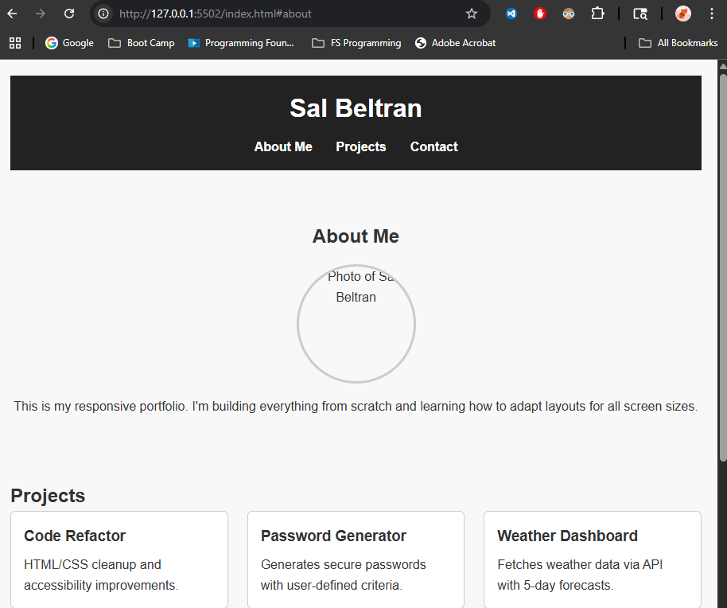

# Responsive Portfolio

## Description
This is a mobile-friendly developer portfolio site built with semantic HTML and responsive CSS. It showcases completed projects and adapts cleanly to desktop, tablet, and mobile devices.

## Technologies Used
- HTML5
- CSS3 (Flexbox, Grid, Media Queries)
- Git/GitHub

## Features
- Responsive navigation bar
- Project cards with hover effects
- About Me section with profile image (placeholder)
- Contact section
- Clickable links to GitHub projects

## Link
[Live Site](https://itsyourpalsal18.github.io/02-responsive-portfolio)

## Screenshot

## License
MIT
